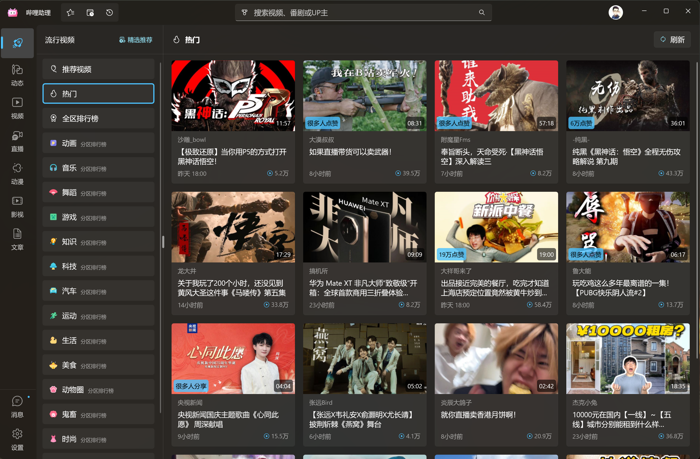
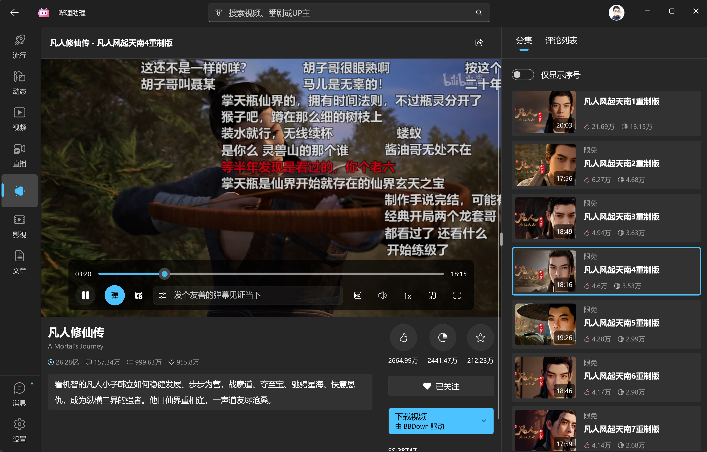

# 哔哩助理

    

`哔哩助理` 是 [哔哩哔哩](https://www.bilibili.com) 的第三方桌面应用，适用于 Windows 11.

<a href="#概述">概述</a> &nbsp;&bull;&nbsp;
<a href="#安装">安装</a> &nbsp;&bull;&nbsp;
<a href="#使用">使用</a> &nbsp;&bull;&nbsp;
<a href="#模块">模块</a> &nbsp;&bull;&nbsp;
<a href="#交流讨论">交流</a> &nbsp;&bull;&nbsp;
<a href="#鸣谢">鸣谢</a>

## 概述

哔哩助理在 [哔哩](https://github.com/Richasy/Bili.Uwp) 的基础上通过 Windows App SDK 进行了重构.

哔哩助理将以更开放的态度进行开发，借助社区力量，共同构建一个有意思的 UGC 客户端。

## 安装

### 商店下载（推荐）

  <a title="从 Microsoft Store 中获取" href="https://www.microsoft.com/store/apps/9MVFJLPH517M?launch=true&mode=full" target="_blank">
    <picture>
      <source srcset="https://get.microsoft.com/images/en-US%20light.svg" media="(prefers-color-scheme: dark)" />
      <source srcset="https://get.microsoft.com/images/en-US%20dark.svg" media="(prefers-color-scheme: light), (prefers-color-scheme: no-preference)" />
      
    </picture>
  </a>

### 侧加载

1. 打开系统设置，依次选择 `系统` -> `开发者选项`，打开 `开发人员模式`。滚动到页面底部，展开 `PowerShell` 区块，开启 `更改执行策略...` 选项
2. 打开 [Release](https://github.com/Richasy/Bili.Copilot/releases) 页面
3. 在最新版本的 **Assets** 中找到应用包下载。命名格式为：`Bili.Copilot_{version}.zip`
4. 下载应用包后解压，右键单击文件夹中的 `install.ps1` 脚本，选择 `使用 PowerShell 运行`

## 使用

### 登录

哔哩助理优先使用扫码登录，如果你偏好其它的登录方式（比如手机/用户名密码），你可以选择网页登录。

### 视频播放

新版本的哔哩助理（V2）支持两种播放方案：

1. MPV
2. 原生（MediaFoundation）

哔哩助理已经将 MPV 嵌入到了 WinUI XAML 界面之中，可以借助 MPV 强大的播放能力实现稳定高效的在线流媒体播放，这也是默认的选项。

尽管 MPV 有着更好的播放效果，但在部分设备上（比如 AMD 显卡）可能会出现黑屏，此时建议使用原生播放器播放。

下面是两种播放方案的具体比较，请根据自己的情况选择合适的播放方案：

|方案|优点|缺点|
|-|-|-|
|MPV|解码速度快，播放稳定|内存占用相对较高，部分设备不支持|
|原生|内存占用低，兼容性好|对2K以上的清晰度支持较差，部分直播无法播放|

## 视频下载

新版本的哔哩助理（V2）内置了 [BBDown](https://github.com/nilaoda/BBDown) 作为下载工具，也内置了 ffmpeg 作为混流工具，用户无需额外下载依赖，在视频播放下面点击下载按钮即可按需下载。

> [!WARNING]
> 目前 ffmpeg 仅内置了 x64 版本，如果你的设备是 Windows 10 ARM64，那么将无法使用内置的下载器。如果设备是 Windows 11，那么可以正常使用 X64 的 ffmpeg。

### 调用外部下载器

部分同学可能有自己配置好的 BBDown，那么可以在设置页面的下载设置中打开 `下载时调用外部BBDown`。你还可以选择在下载时仅复制下载命令，以便进行二次编辑。

## 交流讨论

有兴趣一起交流的话，可以加 QQ 群，进群请注明正在使用哪款软件。

## 应用截图

## 鸣谢

- [Windows App SDK](https://github.com/microsoft/windowsappsdk)
- [WinUI](https://github.com/microsoft/microsoft-ui-xaml)
- [BiliBili](https://www.bilibili.com/)
- [哔哩哔哩-API收集整理](https://github.com/SocialSisterYi/bilibili-API-collect)
- [BBDown](https://github.com/nilaoda/BBDown)
- [寒霜弹幕使](https://github.com/cotaku/DanmakuFrostMaster)
- [cnbluefire/WinUI3.Win2D](https://github.com/cnbluefire/WinUI3.Win2D)
- [Windows Community Toolkit](https://github.com/CommunityToolkit/Windows)
- [FluentIcons](https://github.com/davidxuang/FluentIcons)
- 以及其他在开发过程中提供过助力的小伙伴