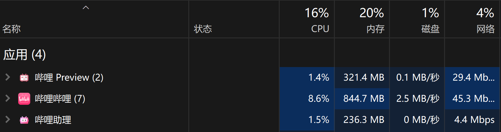

# 哔哩助理

    

`哔哩助理` 是 [哔哩哔哩](https://www.bilibili.com) 的第三方桌面应用，适用于 Windows 11.

<a href="#概述">概述</a> &nbsp;&bull;&nbsp;
<a href="#安装">安装</a> &nbsp;&bull;&nbsp;
<a href="#使用">使用</a> &nbsp;&bull;&nbsp;
<a href="#模块">模块</a> &nbsp;&bull;&nbsp;
<a href="#数据收集">数据收集</a>

## 概述

哔哩助理在 [哔哩](https://github.com/Richasy/Bili.Uwp) 的基础上通过 Windows App SDK 进行了重构，并通过 [小幻助理](https://github.com/Richasy/FantasyCopilot) 提供了 AI 功能.

哔哩助理将以更开放的态度进行开发，借助社区力量，共同构建一个有意思的 UGC 客户端。

## 安装

1. 打开系统设置，依次选择 `系统` -> `开发者选项`，打开 `开发人员模式`。滚动到页面底部，展开 `PowerShell` 区块，开启 `更改执行策略...` 选项
2. 打开 [Release](https://github.com/Richasy/Bili.Copilot/releases) 页面
3. 在最新版本的 **Assets** 中找到应用包下载。命名格式为：`Bili.Copilot_{version}.zip`
4. 下载应用包后解压，右键单击文件夹中的 `install.ps1` 脚本，选择 `使用 PowerShell 运行`
   - 如果你不是第一次安装哔哩助理，那么直接双击后缀为 `msix` 的安装文件即可更新或安装

## 使用

### 常规

- 哔哩助理保留了常用的B站功能，但在开始使用前，你必须扫码登录自己的B站账户
- 对于 ARM64 设备，如果你使用 Win11，可以直接下载 x64 安装包使用
- 对于 Windows 10 设备，未来会逐步放弃支持
- 应用主窗口大小固定，不可调整。其它子窗口如播放窗口、图片窗口等则可以自由调整。
- 应用采用卡片式设计，对于卡片，右键单击也许会有惊喜
- 其他的懒得写了，自己把玩吧

### 播放器

哔哩助理放弃了原生的 MediaPlayer 播放解决方案，因为在哔哩中验证了该方案并不能取得非常好的效果，特别是在面对哔哩哔哩这种流媒体时总有掣肘。

于是在哔哩助理中使用了基于 ffmpeg 的 [Flyleaf](https://github.com/SuRGeoNix/Flyleaf) 作为播放器，并根据实际情况进行了代码优化。

在播放同一条 4K 120fps 的视频时，哔哩、哔哩哔哩和哔哩助理的资源占用如下：

*测试视频：[【4K 120帧 Hi-Res】一首《スパークル(火花）》，能否让你回想起她的名字](https://www.bilibili.com/video/BV14X4y1m7CQ)*

**以上测试很不严谨，结果仅供参考**

### AI

哔哩助理本身不提供 AI 接口，AI 功能的实现依赖于我的另一个应用 [小幻助理](https://github.com/Richasy/FantasyCopilot)。

所以如果你想要使用哔哩助理的 AI 功能，你需要先安装小幻助理，然后添加模型相关的配置。

在哔哩助理内，提供了两种连接方式：`应用服务` 与 `协议启动`。

应用服务可以在不启动小幻助理的情况下获取数据，但仅支持 Azure Open AI 和 Open AI。

协议启动就是把需要总结的内容发送给小幻助理，在小幻助理中显示内容。这种方式支持自定义连接器，但是用户体验没有应用服务好。

所以请根据自己的情况选择合适的连接方式。

## 模块

哔哩助理集成了多个功能模块：

- [Flyleaf](https://github.com/SuRGeoNix/Flyleaf)
  
  一个基于 ffmpeg 的播放器，内建了截图和录屏的支持，做了非常棒的工作！由于哔哩助理播放的内容较为特殊，我需要对代码进行微调，所以应用内部使用的是派生版本。

- [BBDown](https://github.com/nilaoda/BBDown)

  一个用于哔哩哔哩视频下载的命令行工具，效果很好。在迁移到 WinAppSDK 后，哔哩助理简化了 BBDown 的调用，如果你的设备安装了 BBDown，可以直接点击视频内的下载按钮进行下载。视频内容会被下载至视频文件夹的 `哔哩下载` 目录中。

- [小幻助理](https://github.com/Richasy/FantasyCopilot)

  我制作的 AI 应用，支持 Azure Open AI 与 Open AI 及几乎所有大模型（理论上），哔哩助理的 AI 功能将由小幻助理提供支持。

哔哩助理也许会在未来集成更多的功能模块。

## 应用截图

## 数据收集

哔哩助理是个人练手作品，开发者承诺不会采集用户的隐私数据，同时不会将该应用用于商业用途。

哔哩助理添加了 AppCenter 作为数据遥测工具，此举是为了了解一些功能的使用情况，以便后期有针对性地进行调整，采集的数据不包含任何个人隐私信息。

你可以在 [TraceLogger.cs](./src/App/TraceLogger.cs) 中查看用于遥测的采集内容。

应用在运行时会记录错误，这些错误通常保存在本地日志中，只有遇到未捕获的错误及应用崩溃才会将这部分数据上传至 AppCenter 供开发者分析。