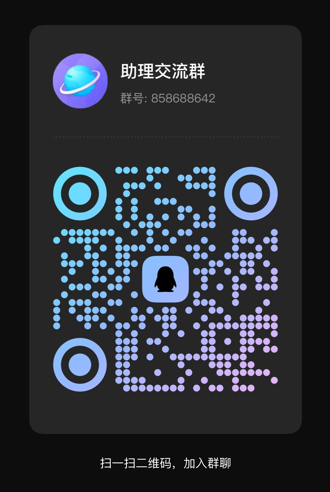
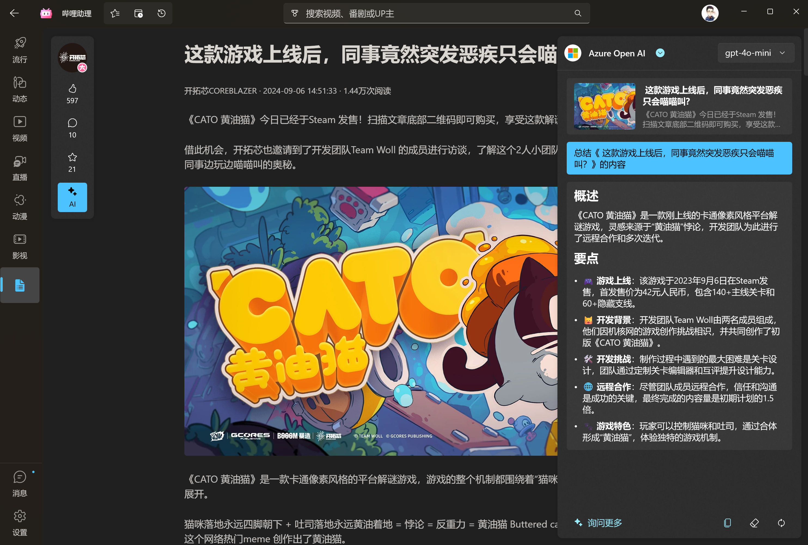

<p align="center">

</p>

<div align="center">

# 哔哩助理

[](https://github.com/Richasy/Bili.Copilot/releases)    

`哔哩助理` 是 [哔哩哔哩](https://www.bilibili.com) 的第三方桌面应用，适用于 Windows 11.

</div>
<p align="center">
<a href="#概述">概述</a> &nbsp;&bull;&nbsp;
<a href="#开发">开发</a> &nbsp;&bull;&nbsp;
<a href="#安装">安装</a> &nbsp;&bull;&nbsp;
<a href="#使用">使用</a> &nbsp;&bull;&nbsp;
<a href="#模块">模块</a> &nbsp;&bull;&nbsp;
<a href="#交流讨论">交流</a> &nbsp;&bull;&nbsp;
<a href="#鸣谢">鸣谢</a>
</p>

## 概述

哔哩助理在 [哔哩](https://github.com/Richasy/Bili.Uwp) 的基础上通过 Windows App SDK 进行了重构.

哔哩助理将以更开放的态度进行开发，借助社区力量，共同构建一个有意思的 UGC 客户端。

文档地址：[哔哩助理](https://bili.richasy.net)

## 安装

### 商店下载（推荐）

<p align="left">
  <a title="从 Microsoft Store 中获取" href="https://www.microsoft.com/store/apps/9MVFJLPH517M?launch=true&mode=full" target="_blank">
    <picture>
      <source srcset="https://get.microsoft.com/images/en-US%20light.svg" media="(prefers-color-scheme: dark)" />
      <source srcset="https://get.microsoft.com/images/en-US%20dark.svg" media="(prefers-color-scheme: light), (prefers-color-scheme: no-preference)" />
      
    </picture>
  </a>
</p>

### 侧加载

1. 打开系统设置，依次选择 `系统` -> `开发者选项`，打开 `开发人员模式`。滚动到页面底部，展开 `PowerShell` 区块，开启 `更改执行策略...` 选项
2. 打开 [Release](https://github.com/Richasy/Bili.Copilot/releases) 页面
3. 在最新版本的 **Assets** 中找到应用包下载。命名格式为：`BiliCopilot_{version}_{platform}.zip`
4. 下载应用包后解压，右键单击文件夹中的 `install.ps1` 脚本，选择 `使用 PowerShell 运行`

## 开发

哔哩助理拆分了多个模块的代码至独立仓库中，以便于其他开发者参考和使用。

- [bili-kernel](https://github.com/Richasy/bili-kernel)  
  哔哩助理与 BiliBili API 交互的核心代码，是一层 .NET 包装器，基于 .NET Standard 2.0，便于移植和二次开发。
- [semantic-kernel](https://github.com/Richasy/semantic-kernel)  
  基于 [microsoft/semantic-kernel](https://github.com/microsoft/semantic-kernel) 进行二次开发，支持更多国内大模型。
- [mpv-winui](https://github.com/Richasy/bili-kernel)  
  哔哩助理的核心播放器之一，将 MPV 集成进 WinUI3 以实现良好的播放体验。
- [WinUI.Share](https://github.com/Richasy/WinUI.Share)  
  我在多个 WinAppSDK 项目之间共用的一些基础样式及实现。

这四个仓库以子模块的形式集成在哔哩助理开发项目中，所以在克隆本仓库时，需要同时克隆子仓库。

第一次克隆时可以运行下面的命令：

```shell
git clone --recurse-submodules https://github.com/Richasy/Bili.Copilot.git
```

如果你已经克隆了仓库，但是忘记克隆子仓库了，那么可以运行下面的命令：

```shell
git submodule update --init --recursive
```

在克隆之后，你需要在命令行中进入克隆的三个子模块的目录，切换它们的 HEAD，这是对应的列表：

|模块|路径|HEAD (分支)|
|-|-|-|
|bili-kernel|src\Libs\bili-kernel|main|
|semantic-kernel|src\Libs\semantic-kernel|dev|
|mpv-winui|src\Libs\mpv-winui|main|
|WinUI.Share|src\Libs\WinUI.Share|main|

切换分支完成后，还需要下载 mpv / ffmpeg 到对应的目录：

|文件名|目录|说明|
|-|-|-|
|libmpv-2.dll|src\Desktop\BiliCopilot.UI\Assets\libmpv\x64(或者 arm64)|可以在 [mpv-winbuild](https://github.com/zhongfly/mpv-winbuild) 下载最新的 dev 构建（x64 对应 x86_x64，arm64 对应 aarch64），把 libmpv-2.dll 放入对应文件夹中，用以 mpv 播放|
|ffmpeg.exe|src\Desktop\BiliCopilot.UI\Assets\ffmpeg|可以在 [mpv-winbuild](https://github.com/zhongfly/mpv-winbuild) 下载最新 ffmpeg x64 构建，将 ffmpeg.exe 放入对应文件夹中，用于视频下载后的混流|

## 使用

### 登录

哔哩助理优先使用扫码登录，如果你偏好其它的登录方式（比如手机/用户名密码），你可以选择网页登录。

### 视频播放

新版本的哔哩助理（V2）支持多种播放方案：

1. MPV
2. 原生（MediaFoundation）
3. 外部播放器（支持 MPV 和 MPV.NET）
4. 网页播放器

哔哩助理已经将 MPV 嵌入到了 WinUI XAML 界面之中，可以借助 MPV 强大的播放能力实现稳定高效的在线流媒体播放，这也是默认的选项。

> [!TIP]
> 目前正在进行播放方案的过渡测试，MPV 的播放方案目前在应用内存在两个，推荐的播放器选择是 `岛`，后期会替换掉现在的 mpv 播放方案。

下面是几种播放方案的具体比较，请根据自己的情况选择合适的播放方案：

|方案|优点|缺点|
|-|-|-|
|MPV|解码速度快，播放稳定|内存占用相对较高|
|原生|内存占用低，兼容性好|对2K以上的清晰度支持较差，部分直播无法播放|
|外部播放器|自定义程度高，可以获得最佳播放体验|需要额外安装配置，门槛较高|
|网页|只要不是断网就能播放|和打开浏览器看网页没有太大差别|

> [!TIP]
> **关于网页播放器**
>
> Windows 硬件平台太多，开发者无法保证在各个平台都有着稳定的体验，如果你的设备在播放视频时出现各种奇奇怪怪的bug，网页播放器将是你最稳妥的选择。
>
> 为了提高网页播放器的体验，哔哩助理引入了 [BewlyBewly](https://github.com/BewlyBewly/BewlyBewly) 作为默认插件，以便和应用主题同步，并提供美观的用户界面。
>
> _特在此向 BewlyBewly 的开发者表示感谢。_

### 人工智能

哔哩助理与 [小幻助理](https://github.com/Richasy/Rodel.Agent) 共享代码，接入 20 余种国内外主流 AI 模型服务，给用户足够多的选择。

你可以通过大语言模型对视频/文章内容进行总结（视频需要有字幕），或者结合内容与评论对视频/文章进行 AI 评价。

或许更进一步，你可以基于当前视频/文章的内容与模型对话，针对性地回答你的疑问。

开发者会持续探索大语言模型和B站内容结合的边界，更进一步挖掘 AI 潜力，也欢迎你提出你的想法，真正让 AI 有用起来。

## 视频下载

新版本的哔哩助理（V2）内置了 [BBDown](https://github.com/nilaoda/BBDown) 作为下载工具，也内置了 ffmpeg 作为混流工具，用户无需额外下载依赖，在视频播放下面点击下载按钮即可按需下载。

> [!WARNING]
> 目前 ffmpeg 仅内置了 x64 版本，如果你的设备是 Windows 10 ARM64，那么将无法使用内置的下载器。如果设备是 Windows 11，那么可以正常使用 X64 的 ffmpeg。

### 调用外部下载器

部分同学可能有自己配置好的 BBDown，那么可以在设置页面的下载设置中打开 `下载时调用外部BBDown`。你还可以选择在下载时仅复制下载命令，以便进行二次编辑。

## 交流讨论

有兴趣一起交流的话，可以加 QQ 群，进群请注明正在使用哪款软件。



## 应用截图




## 鸣谢

- [Windows App SDK](https://github.com/microsoft/windowsappsdk)
- [WinUI](https://github.com/microsoft/microsoft-ui-xaml)
- [BiliBili](https://www.bilibili.com/)
- [哔哩哔哩-API收集整理](https://github.com/SocialSisterYi/bilibili-API-collect)
- [BBDown](https://github.com/nilaoda/BBDown)
- [BewlyBewly](https://github.com/BewlyBewly/BewlyBewly)
- [寒霜弹幕使](https://github.com/cotaku/DanmakuFrostMaster)
- [cnbluefire/WinUI3.Win2D](https://github.com/cnbluefire/WinUI3.Win2D)
- [Windows Community Toolkit](https://github.com/CommunityToolkit/Windows)
- [FluentIcons](https://github.com/davidxuang/FluentIcons)
- [ComputeSharp](https://github.com/Sergio0694/ComputeSharp)
- 以及其他在开发过程中提供过助力的小伙伴