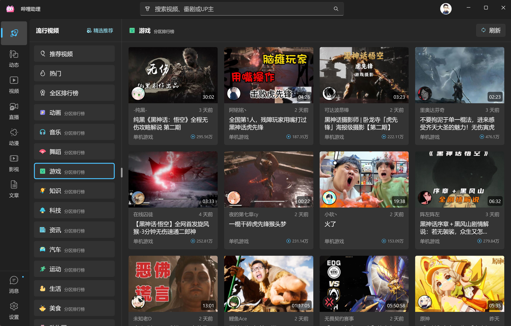
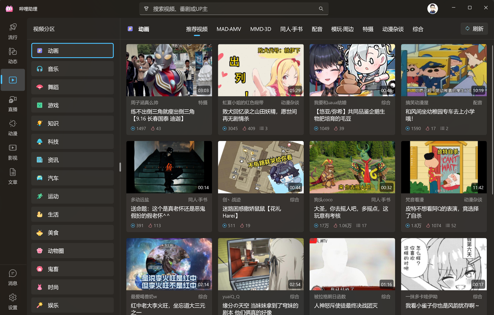
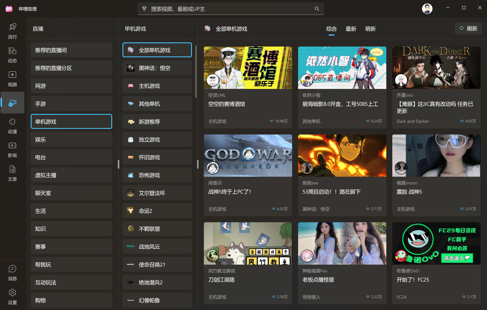
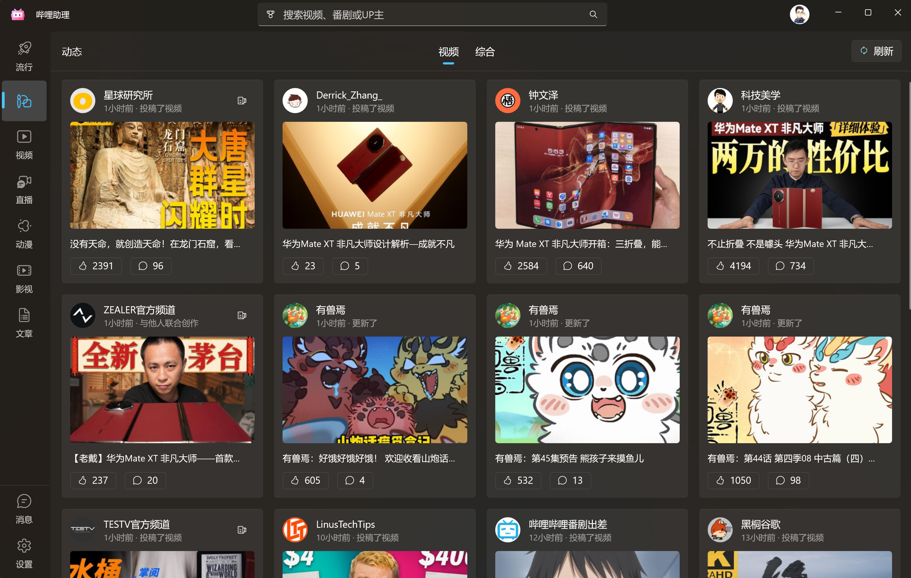
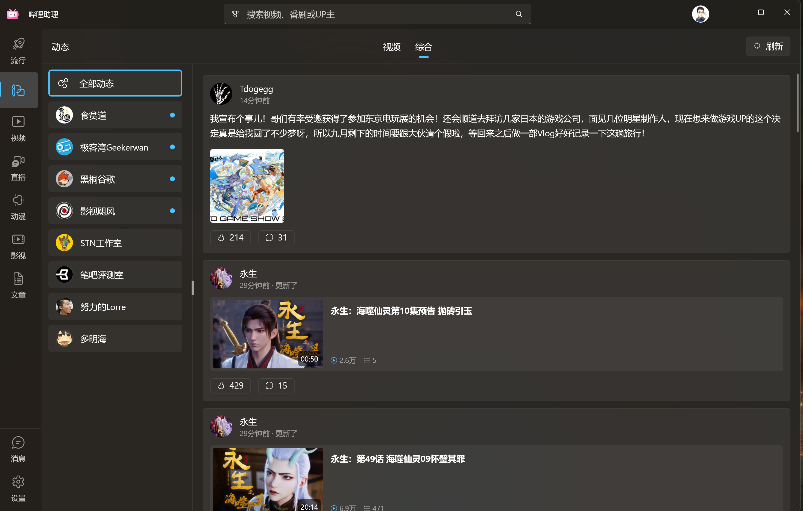
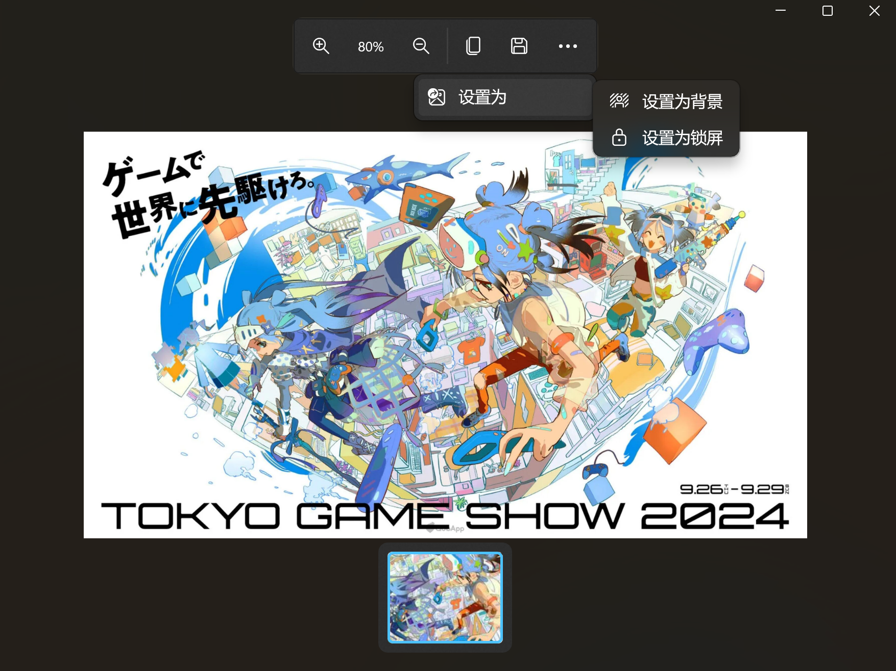
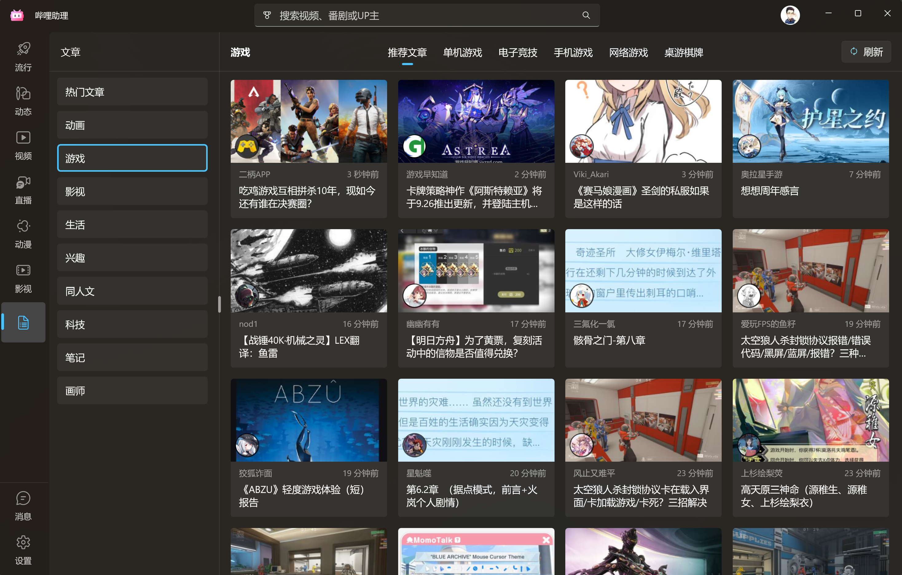
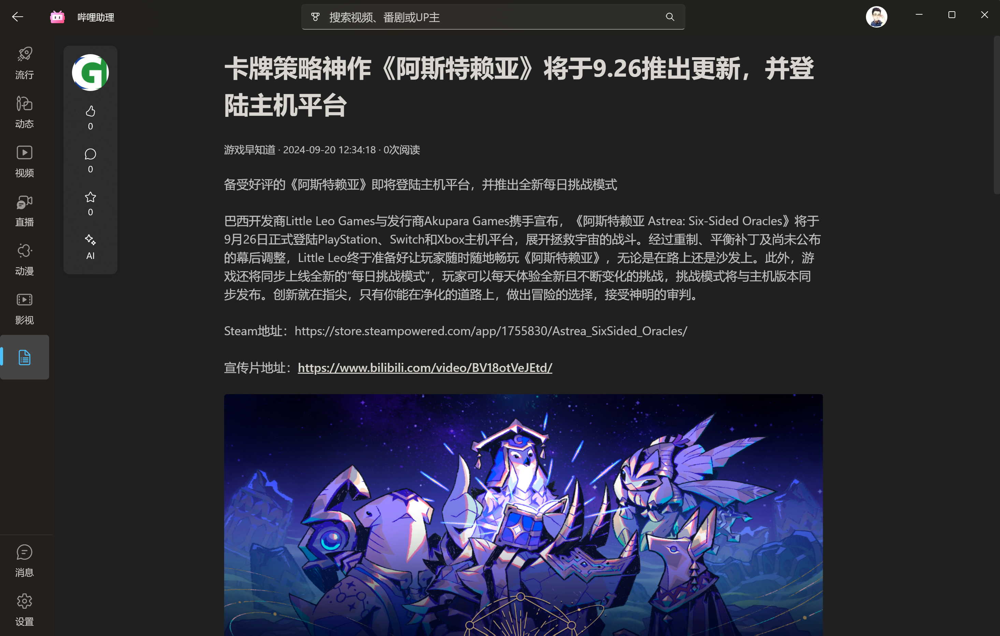

# 功能模块

## 视频模块

BiliBili 最多的就是视频了，视频大致可以分作以下几个模块：

1. 推荐视频  
   这个是B站根据个人偏好推荐的一些视频。
2. 热门视频  
   这个是B站当天综合热度（播放量/互动）最高的一批视频
3. 排行榜  
   和热门类似，包含了各个分区或者全站热度最高的视频。
4. 各分区视频
   各个内容分区里的视频，以及分区中的子分区视频。

这是哔哩助理划分视频模块的依据。

当你登录后，第一个页面就是 `流行`，它包含了 `推荐视频`、`热门视频` 以及 `全区排行榜` 和各分区排行榜。

> [!TIP]
> 曾经接到反馈，有同学反应点击 `刷新` 按钮，视频没有更新。  
> 事实上，`热门`，`排行榜` 这类视频模块的内容短时间内是固定的，刷新只是重新从B站服务器获取数据，并不意味着每次刷新内容都会变化。  
> 只有推荐视频才会每次刷新都有不同的内容，因为这个是针对你的喜好定制的视频列表。

如果你在想快速了解 B站 最热门的视频内容，那就可以在这里找，通常质量都比较高。

### 个性化推荐

B站桌面客户端有一个 `精选` 功能，推荐的视频更符合个人喜好。

哔哩助理也提供了相同的功能入口，可以获得和B站客户端一样的推荐内容（生成一个播放列表）。

如果你不知道看什么，那么点击这里也许会有惊喜。

### 视频分区

如果你想看到一些 `新鲜` 的视频，可以点进左侧导航栏第三个分区 `视频`。

## 直播模块

你可以在侧边导航栏进入直播模块。

找到你想看的直播间后，点击进入即可。

> [!TIP]
> 进入直播间之后，你可能会觉得界面比较简陋，仅支持观看直播和发弹幕。
>
> 之所以做成这样，并不完全是因为我懒。
>
> 直播和钞票联系非常紧密，为了避嫌，我不会考虑任何和金钱挂钩的功能（比如礼物什么的）。
>
> 如果你对这一块功能有着特别的需求，请在设置中将播放器类型调整为 `网页`，以便在网页端进行操作。

## PGC 内容

### 什么是 PGC？

众所周知，B站是一个 UGC 社区，所谓 UGC，就是用户生产内容（User-Generated-Content），泛指我们上传的视频/动态/文章等内容。

而 PGC，则是专业生产内容（Professionally-Generated-Content），通常是指番剧/电影/电视剧等由专业团队拍摄的商业内容。

多少人上B站就是为了看番，所以 PGC 内容也是一个重要的模块。

---

在哔哩助理中，PGC 内容被分配到两个页面，分别是 `动漫` 和 `影视`。

### 动漫

动漫包括 `番剧` 和 `国创`，同时支持按时间线查看发布的动漫内容。

### 影视

影视包括 `电影`，`电视剧` 和 `纪录片`，你可以在左侧栏顶部切换不同的内容类型，并调整下方的筛选条件以便找到适合自己的内容。

## 用户相关

### 关注动态

在导航栏中你能找到动态页面，动态页面包含两个分区：`视频` 与 `综合`。

#### 视频动态

在视频分区下，你能按照时间线查看关注的UP主发布的视频动态，如果你追了某部番，那么更新也会出现在这里。

#### 综合动态

综合动态包括了图文动态和视频动态，你既可以按时间线查看全部动态内容，也可以在左侧查看有更新的 UP 主的动态。

对于图文动态，点击图片即可在新窗口打开图片，你能够对图片做一些操作，比如复制或者保存到本地，也可以一键设置壁纸和锁屏。

### 用户空间

一般情况下，点击用户头像即可进入该用户的空间查看内容。

用户空间页面和动态页面类似，也分了 `视频` 和 `综合` 两个分区。

## 专栏

专栏内容集中在 `文章` 页面，你可以在导航栏中找到。

由于专栏内容的特殊性，当你打开某篇文章时，实际上是在网页中打开。

哔哩助理内嵌了 WebView2，在第一次打开时可能会加载一小会儿，但是阅读体验会很干净。

