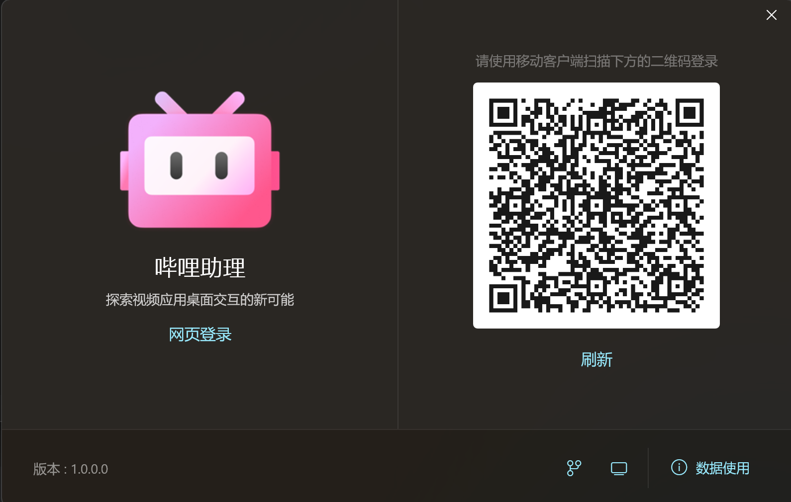
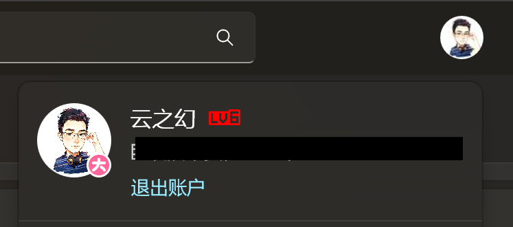

# 登录体验

哔哩助理为了减小开发困难，被设计成登录后才能使用。

在第一次打开应用时，会弹出登录框。

## 扫码登录

应用推荐使用扫码登录，你可以用你的移动客户端扫描登录界面右侧的二维码，并在移动客户端上确认以登录。

确认后，应用会自动重启。

## 网页登录

如果你想要以其它方式登录，比如手机号，或者账户密码等。

那么你可以点击左侧LOGO下方的网页登录按钮。

此时你会跳转到网页登录界面，在完成登录后，应用会检测你的 cookies，然后生成访问令牌，并完成登录。

## 关于用户凭据

哔哩助理作为第三方应用，仅能根据网上可以找到的信息尝试构建应用，开发者最终选择以云视听小电视（TV版BiliBili）的API来构建应用。

所以不论你是扫码登录还是网页登录，最终你的用户凭据都会被转换成适用于云视听小电视的访问令牌（Access Token），由于还有部分 API 必须访问网页版本，所以应用也会存储 cookies 信息，以便于进行网页API的授权验证。

> [!WARNING]
> 尽管大部分 API 可以工作，但是云视听小电视的API有一个已知问题，那就是动态请求无法获取到关于专栏文章的内容。
> 这个是由B站服务器控制的，开发者无能为力。

## 退出登录

如果你需要退出账户，可以在应用顶部头像处打开个人菜单，然后点击 `退出账户` 即可。

